<div align="center">

# 🎓 University Database Management System
### *MySQL SQL Queries, CRUD, Joins & Advanced SQL Project*


</div>

---

# 📋 Table of Contents

- [📌 Overview](#-overview)
- [🎯 Objective](#-objective)
- [✨ Features](#-features)
- [🏗️ Database Structure](#️-database-structure)
- [🗂️ Tables](#️-tables)
- [🔍 SQL Queries & Outputs](#-sql-queries--outputs)
- [🔄 CRUD Operations](#-crud-operations)
- [🔗 JOIN Operations](#-join-operations)
- [📊 Aggregate Functions](#-aggregate-functions)
- [🧮 Advanced SQL Concepts](#-advanced-sql-concepts)
- [🛠️ Tech Stack](#️-tech-stack)
- [📈 Learning Outcomes](#-learning-outcomes)
- [👤 Author](#-author)

---

# 📌 Overview

This project is a **MySQL University Database Management System** created to practice relational database concepts and practical SQL queries.

The database manages **students, courses, instructors, enrollments, and departments**. It demonstrates CRUD operations, filtering, grouping, aggregate functions, JOINs, subqueries, date functions, string functions, window functions, and CASE expressions.

---

# 🎯 Objective

Develop a relational university database and perform practical SQL queries to analyze relationships between students, courses, instructors, enrollments, and departments.

The project focuses on applying SQL concepts to real-world academic data management scenarios.

---

# ✨ Features

- 🎓 Manage student information
- 📚 Manage university courses
- 👨‍🏫 Manage instructor information
- 📝 Track student enrollments
- 🏢 Manage academic departments
- 🔄 Perform CRUD operations
- 🔍 Filter and retrieve specific records
- 🔗 Use INNER JOIN and LEFT JOIN
- 📊 Use aggregate functions such as `COUNT()`, `AVG()`, and `MAX()`
- 🧮 Use `GROUP BY` and `HAVING`
- 🔎 Use subqueries
- 📅 Extract years from dates
- 🔤 Concatenate text using `CONCAT()`
- 📈 Calculate running totals using window functions
- 🏷️ Categorize students using `CASE`

---

# 🏗️ Database Structure

```text
Database: final_project
│
├── 🎓 Students
│
├── 📚 Courses
│      └── DepartmentID
│
├── 👨‍🏫 Instructors
│      └── DepartmentID
│
├── 📝 Enrollments
│      ├── StudentID
│      └── CourseID
│
└── 🏢 Departments
       └── DepartmentID
```

### Relationships

```text
Departments
   │
   ├──────────────► Courses
   │
   └──────────────► Instructors

Students
   │
   └──────────────► Enrollments ◄────────────── Courses
```

---

# 🗂️ Tables

## 🎓 Students

| Column | Data Type | Key |
|--------|-----------|-----|
| studentID | INT | Primary Key |
| first_name | VARCHAR(50) | — |
| last_name | VARCHAR(50) | — |
| email | VARCHAR(50) | — |
| birth_date | DATE | — |
| enrolment_date | DATE | — |

Stores student personal information and university enrollment dates.

---

## 📚 Courses

| Column | Data Type | Key |
|--------|-----------|-----|
| courseID | INT | Primary Key |
| course_name | VARCHAR(50) | — |
| departmentID | INT | Foreign Key |
| credits | INT | — |

Stores course information, department association, and credit values.

---

## 👨‍🏫 Instructors

| Column | Data Type | Key |
|--------|-----------|-----|
| instructorID | INT | Primary Key |
| first_name | VARCHAR(50) | — |
| last_name | VARCHAR(50) | — |
| email | VARCHAR(50) | — |
| departmentID | INT | Foreign Key |
| salary | DECIMAL(10,2) | — |

Stores instructor details, department information, and salary.

---

## 📝 Enrollments

| Column | Data Type | Key |
|--------|-----------|-----|
| enrolmentID | INT | Primary Key |
| studentID | INT | Foreign Key |
| courseID | INT | Foreign Key |
| enrolmentDate | DATE | — |

Connects students with the courses in which they are enrolled.

---

## 🏢 Departments

| Column | Data Type | Key |
|--------|-----------|-----|
| departmentID | INT | Primary Key |
| department_name | VARCHAR(50) | — |

Stores university department information.

---

# 🔍 SQL Queries & Outputs

## Q1. Perform CRUD Operations on All Tables

- Insert a new student
- Retrieve student records
- Update a student's last name
- Delete the student record

### Output

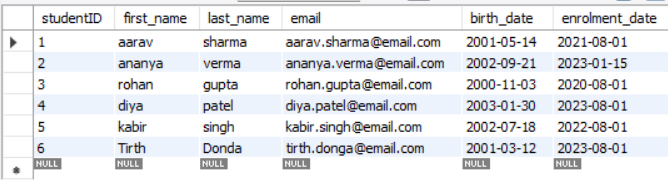


---

## Q2. Retrieve Students Who Enrolled After 2022

Uses `WHERE` to filter students based on their enrollment date.

```sql
SELECT * 
FROM students 
WHERE enrolment_date > '2022-12-31';
```

### Output

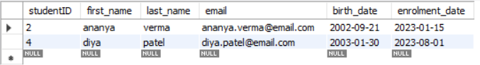

---

## Q3. Retrieve Courses Offered by the Mathematics Department

Uses `JOIN`, filtering, and `LIMIT` to retrieve up to 5 courses from the Mathematics department.

### Output


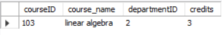

---

## Q4. Count Students Enrolled in Each Course

Uses `COUNT()`, `GROUP BY`, and `HAVING` to find courses with more than 5 students.

### Output

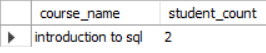

---

## Q5. Find Students Enrolled in Both Introduction to SQL and Data Structures

Uses multiple JOINs, `IN`, `GROUP BY`, and `HAVING COUNT(DISTINCT ...)`.

### Output


---

## Q6. Find Students Enrolled in Either Introduction to SQL or Data Structures

Uses `DISTINCT` and `OR` to retrieve students enrolled in either course.

### Output

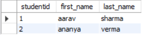

---

## Q7. Calculate the Average Number of Credits

Uses the `AVG()` aggregate function to calculate the average credits across all courses.

### Output


---

## Q8. Find the Maximum Instructor Salary in Computer Science

Uses `MAX()` with a JOIN to find the highest salary in the Computer Science department.

### Output

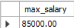

---

## Q9. Count Students Enrolled in Each Department

Uses multiple JOINs, `COUNT(DISTINCT ...)`, and `GROUP BY` to calculate department-wise student enrollment.

### Output

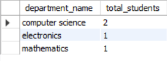

---

## Q10. INNER JOIN — Retrieve Students and Their Courses

Uses an `INNER JOIN` between students, enrollments, and courses.

### Output

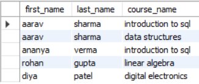

---

## Q11. LEFT JOIN — Retrieve All Students and Their Courses

Uses `LEFT JOIN` to display every student and their corresponding course, if available.

### Output

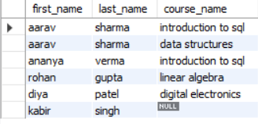

---

## Q12. Subquery — Find Students in Courses With More Than 10 Students

Uses a subquery with `GROUP BY` and `HAVING` to identify qualifying courses.

### Output

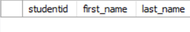

---

## Q13. Extract the Enrollment Year

Uses the `YEAR()` date function to extract the year from each student's enrollment date.

### Output

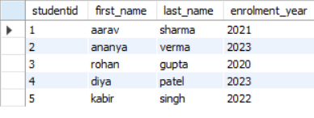

---

## Q14. Concatenate Instructor Names

Uses `CONCAT()` to combine instructor first and last names into a single `full_name` column.

### Output

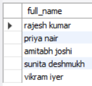

---

## Q15. Calculate the Running Total of Students Enrolled

Uses a **window function** with `COUNT() OVER()` and `ORDER BY` to calculate a running enrollment total.

### Output

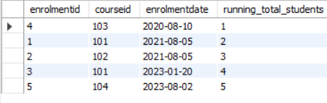

---

## Q16. Label Students as Senior or Junior

Uses a `CASE` expression and `DATE_SUB()` to classify students based on their enrollment date.

### Output

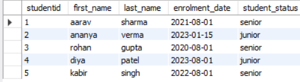

---

# 🔄 CRUD Operations

### Create

- Insert student records
- Insert course records
- Insert instructor records
- Insert enrollment records
- Insert department records

### Read

- Retrieve students
- Retrieve courses
- Retrieve instructors
- Retrieve enrollments
- Retrieve departments
- Filter records using `WHERE`

### Update

- Update student information
- Modify records using `UPDATE`

### Delete

- Delete student records using `DELETE`

---

# 🔗 JOIN Operations

| JOIN Type | Usage in Project |
|-----------|------------------|
| 🔵 INNER JOIN | Retrieve students and their corresponding courses |
| 🟢 LEFT JOIN | Retrieve all students and their courses, if any |
| 🔗 Multi-Table JOIN | Connect students, enrollments, courses, and departments |

### Example Relationship

```text
Students
   │
   │ studentID
   ▼
Enrollments
   │
   │ courseID
   ▼
Courses
   │
   │ departmentID
   ▼
Departments
```

---

# 📊 Aggregate Functions

The project uses several SQL aggregate functions:

| Function | Purpose |
|----------|---------|
| `COUNT()` | Count students and enrollment records |
| `AVG()` | Calculate average course credits |
| `MAX()` | Find maximum instructor salary |

Additional grouping operations include:

- `GROUP BY`
- `HAVING`
- `COUNT(DISTINCT ...)`

---

# 🧮 Advanced SQL Concepts

### 🔎 Subquery

Used in **Q12** to find courses having more than 10 students.

### 📅 Date Functions

- `YEAR()`
- `DATE_SUB()`
- `CURRENT_DATE()`

### 🔤 String Function

- `CONCAT()`

### 📈 Window Function

```sql
COUNT(studentid)
OVER (
    ORDER BY enrolmentdate, enrolmentid
)
```

Used to calculate a running total of enrolled students.

### 🏷️ CASE Expression

Used to classify students as:

```text
Senior
Junior
```

based on their enrollment date.

---

# 🛠️ Tech Stack

| Technology | Purpose |
|------------|---------|
| 🐬 MySQL | Relational Database Management System |
| 📝 SQL | Database Query Language |
| 🖥️ MySQL Workbench | Database Management & Query Execution |

---

# 📈 Learning Outcomes

- ✅ Creating relational databases
- ✅ Creating tables with appropriate data types
- ✅ Working with Primary Keys
- ✅ Working with Foreign Keys
- ✅ Understanding table relationships
- ✅ Performing CRUD operations
- ✅ Using WHERE conditions
- ✅ Using JOIN operations
- ✅ Using GROUP BY and HAVING
- ✅ Using aggregate functions
- ✅ Writing subqueries
- ✅ Working with SQL date functions
- ✅ Working with string functions
- ✅ Using window functions
- ✅ Using CASE expressions

---

# 👤 Author

<div align="center">

**Tirth Donga**

[](https://github.com/tirthdonga)

SQL University Database Project

---

### ⭐ Thank You For Visiting This Project ⭐

Made with ❤️ using MySQL & SQL

</div>
