<div align="center">

# 🛒 E-Commerce Store Database

### *MySQL CRUD & SQL Query Project*


</div>

------------------------------------------------------------------------

# 📋 Table of Contents

- [📌 Overview](#-overview)
- [🎯 Objective](#-objective)
- [✨ Features](#-features)
- [🏗️ Database Structure](#️-database-structure)
- [🗂️ Tables](#️-tables)
- [🔄 CRUD Operations](#-crud-operations)
- [📊 Aggregate Functions](#-aggregate-functions)
- [🛠️ Tech Stack](#️-tech-stack)
- [📈 Learning Outcomes](#-learning-outcomes)
- [👤 Author](#-author)

------------------------------------------------------------------------

# 📌 Overview

This project is a **MySQL E-Commerce Store Database** designed to
practice SQL fundamentals including database creation, CRUD operations,
filtering, sorting, aggregate functions, primary keys, and foreign keys.

------------------------------------------------------------------------

# 🎯 Objective

Develop a relational database for an E-Commerce Store and perform
practical SQL queries to understand database management and query
execution.

------------------------------------------------------------------------

# ✨ Features

-   Create and manage relational tables
-   Insert sample records
-   Perform CRUD operations
-   Filter and sort data
-   Use aggregate functions
-   Build relationships using Primary and Foreign Keys

------------------------------------------------------------------------

# 🏗️ Database Structure

``` text
Database
│
├── Customers
├── Orders
├── Products
└── OrderDetails
```

------------------------------------------------------------------------

# 🗂️ Tables

# Customers

-   CustomerID (PK)
-   Name
-   Email
-   Address

| Query |
|-------|
| Insert at least 5 sample customers into the Customers table.
| Retrieve all customer details.
| Update a customer's address.
| Delete a customer using their CustomerID.
| Display all customers whose name is 'Alice'.

### Output

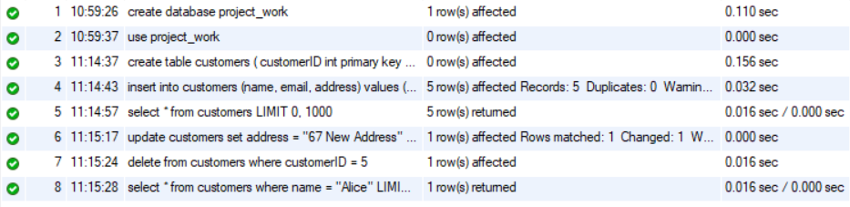<p>
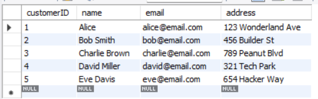<p>
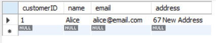<p>

---

# Orders

-   OrderID (PK)
-   CustomerID (FK)
-   OrderDate
-   TotalAmount

| Query |
|-------|
| Insert at least 5 sample orders into the Orders table.
| Retrieve all orders made by a specific customer.
| Update an order's total amount.
| Delete an order using its OrderID.
| Retrieve orders placed in the last 30 days.
| Retrieve the highest, lowest, and average order amount using aggregate functions.

### Output

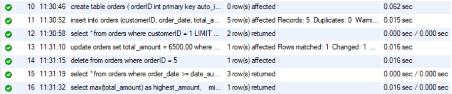<p>
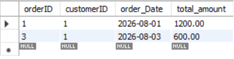<p>
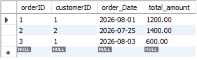<p>
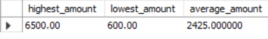<p>

---

# Products

-   ProductID (PK)
-   ProductName
-   Price
-   Stock

| Query |
|-------|
| Insert at least 5 sample products into the Products table.
| Retrieve all products sorted by price in descending order.
| Update the price of a specific product.
| Delete a product if it's out of stock.
| Retrieve products whose price is between ₹500 and ₹2000.
| Retrieve the most expensive and cheapest product using MAX() and MIN().

### Output

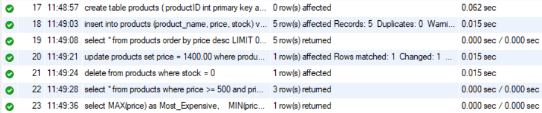<p>
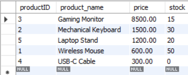<p>
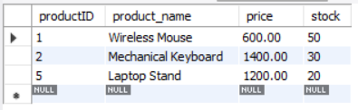<p>
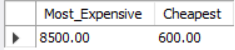<p>

---

# OrderDetails

-   OrderDetailID (PK)
-   OrderID (FK)
-   ProductID (FK)
-   Quantity
-   SubTotal

| Query |
|-------|
| Insert at least 5 sample records into the OrderDetails table.
| Retrieve all order details for a specific order.
| Calculate the total revenue generated from all orders using SUM().
| Retrieve the top 3 most ordered products.
| Count how many times a specific product has been sold using COUNT().

### Output

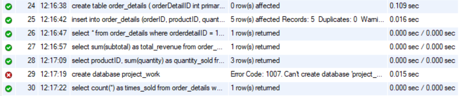<p>
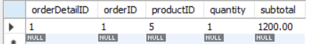<p>
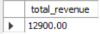<p>
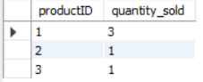<p>
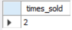<p>

---

# 🔄 CRUD Operations

### Create

-   Insert sample records into all tables.

### Read

-   Retrieve customer, order, product, and order detail records.
-   Filter records using WHERE.
-   Sort data using ORDER BY.

### Update

-   Update customer addresses.
-   Update product prices.
-   Update order amounts.

### Delete

-   Delete customers, products, and orders using IDs.

------------------------------------------------------------------------

# 📊 Aggregate Functions

-   COUNT()
-   SUM()
-   AVG()
-   MAX()
-   MIN()

Used for revenue calculation, highest/lowest prices, average order
amount, and product sales.

------------------------------------------------------------------------

# 🛠️ Tech Stack

  Technology        Purpose
  ----------------- ---------------------
  MySQL             Database
  SQL               Query Language
  MySQL Workbench   Database Management

------------------------------------------------------------------------

# 📈 Learning Outcomes

-   Database creation
-   Table relationships
-   CRUD operations
-   Aggregate functions
-   SQL filtering and sorting
-   Primary & Foreign Keys

------------------------------------------------------------------------

<div align="center">

# 👤 Author

## **Tirth Donga**

[](https://github.com/tirthdonga)

SQL Database Project
---
### ⭐ Thank You For Visiting This Project ⭐

Made with ❤️ using MySQL
---
Video Explanation Link: https://drive.google.com/file/d/1Gky55gW6H77fwAQOUWgy9vW4C95bp7ul/view?usp=drive_link
</div>
