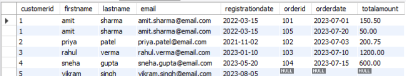
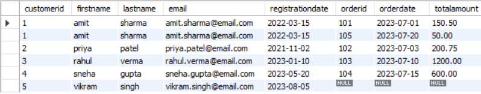

<div align="center">

# 🔗 SQL Joins & Relational Database
### *MySQL Database Project for Practicing JOIN Operations*


</div>

---

# 📋 Table of Contents

- [📌 Overview](#-overview)
- [🎯 Objective](#-objective)
- [✨ Features](#-features)
- [🏗️ Database Structure](#️-database-structure)
- [🗂️ Tables](#️-tables)
- [🔍 SQL Queries & Outputs](#-sql-queries--outputs)
- [🔄 JOIN Operations](#-join-operations)
- [🛠️ Tech Stack](#️-tech-stack)
- [📈 Learning Outcomes](#-learning-outcomes)
- [👤 Author](#-author)

---

# 📌 Overview

This project is a **MySQL relational database project** created to practice and understand different types of SQL JOIN operations. The database contains customer, order, and employee information and demonstrates how related records can be combined using `INNER JOIN`, `LEFT JOIN`, `RIGHT JOIN`, and a `FULL OUTER JOIN` simulation using `UNION`.

---

# 🎯 Objective

Develop a relational MySQL database and use SQL JOIN operations to retrieve related information from multiple tables.

The main objective is to understand how different JOIN types behave when matching records between the `customers` and `orders` tables.

---

# ✨ Features

- 🗄️ Create a MySQL database
- 👥 Store customer information
- 🛒 Store customer order information
- 👨‍💼 Store employee information
- 🔗 Establish relationships using Primary and Foreign Keys
- 🔍 Retrieve related records using SQL JOINs
- 📊 Compare different JOIN operations
- 🔄 Simulate a FULL OUTER JOIN using `UNION`

---

# 🏗️ Database Structure

```text
Database: project_work_2
│
├── 👥 Customers
│      └── customerID (Primary Key)
│
├── 🛒 Orders
│      ├── orderID (Primary Key)
│      └── customerID (Foreign Key)
│
└── 👨‍💼 Employees
       └── employeeID (Primary Key)
```

### Relationship

```text
Customers
    │
    │ customerID
    │
    ▼
Orders
```

The `orders.customerID` column references `customers.customerID`.

---

# 🗂️ Tables

## 👥 Customers

| Column | Data Type | Key |
|--------|-----------|-----|
| customerID | INT | Primary Key |
| firstname | VARCHAR(50) | — |
| lastname | VARCHAR(50) | — |
| email | VARCHAR(100) | — |
| registrationdate | DATE | — |

The `customers` table stores customer identification, contact, and registration information.

---

## 🛒 Orders

| Column | Data Type | Key |
|--------|-----------|-----|
| orderID | INT | Primary Key |
| customerID | INT | Foreign Key |
| orderdate | DATE | — |
| totalamount | DECIMAL(10,2) | — |

The `orders` table stores order information and connects each order to a customer.

---

## 👨‍💼 Employees

| Column | Data Type | Key |
|--------|-----------|-----|
| employeeID | INT | Primary Key |
| firstname | VARCHAR(50) | — |
| lastname | VARCHAR(50) | — |
| department | VARCHAR(50) | — |
| hiredate | DATE | — |
| salary | DECIMAL(10,2) | — |

The `employees` table stores employee details, departments, hiring dates, and salaries.

---

# 🔍 SQL Queries & Outputs

## Q1. INNER JOIN

### Query

**Retrieve all orders and customer details where orders exist.**

```sql
SELECT o.orderID, o.orderdate, o.totalamount,
       c.customerID, c.firstname, c.lastname,
       c.email, registrationdate
FROM orders o
INNER JOIN customers c
ON o.customerid = c.customerid;
```

### Output


---

## Q2. LEFT JOIN

### Query

**Retrieve all customers and their corresponding orders, if any.**

```sql
SELECT c.customerid, c.firstname, c.lastname,
       c.email, c.registrationdate,
       o.orderid, o.orderdate, o.totalamount
FROM customers c
LEFT JOIN orders o
ON c.customerid = o.customerid;
```

### Output



---

## Q3. RIGHT JOIN

### Query

**Retrieve all orders and their corresponding customers, if any.**

```sql
SELECT o.orderid, o.orderdate, o.totalamount,
       c.customerid, c.firstname, c.lastname,
       c.email, c.registrationdate
FROM customers c
RIGHT JOIN orders o
ON c.customerid = o.customerid;
```

### Output


---

## Q4. FULL OUTER JOIN

### Query

**Retrieve all customers and all orders, regardless of matching.**

> MySQL does not provide a direct `FULL OUTER JOIN`, so this project combines `LEFT JOIN` and `RIGHT JOIN` using `UNION`.

```sql
SELECT c.customerid, c.firstname, c.lastname,
       c.email, c.registrationdate,
       o.orderid, o.orderdate, o.totalamount
FROM customers c
LEFT JOIN orders o
ON c.customerid = o.customerid

UNION

SELECT c.customerid, c.firstname, c.lastname,
       c.email, c.registrationdate,
       o.orderid, o.orderdate, o.totalamount
FROM customers c
RIGHT JOIN orders o
ON c.customerid = o.customerid;
```

### Output



---

# 🔄 JOIN Operations

| JOIN Type | Purpose |
|-----------|---------|
| 🔵 INNER JOIN | Returns records that have matching values in both tables |
| 🟢 LEFT JOIN | Returns all records from the left table and matching records from the right table |
| 🟠 RIGHT JOIN | Returns all records from the right table and matching records from the left table |
| 🟣 FULL OUTER JOIN | Returns all records from both tables, whether they match or not |

### FULL OUTER JOIN Implementation

```text
        LEFT JOIN
            +
        RIGHT JOIN
            │
            ▼
          UNION
            │
            ▼
   FULL OUTER JOIN Result
```

---

# 🛠️ Tech Stack

| Technology | Purpose |
|------------|---------|
| 🐬 MySQL | Relational Database Management System |
| 📝 SQL | Database Query Language |
| 🖥️ MySQL Workbench | Database Management & Query Execution |

---

# 📈 Learning Outcomes

- ✅ Creating and managing relational databases
- ✅ Creating tables with appropriate data types
- ✅ Using Primary Keys
- ✅ Using Foreign Keys
- ✅ Understanding table relationships
- ✅ Performing INNER JOIN operations
- ✅ Performing LEFT JOIN operations
- ✅ Performing RIGHT JOIN operations
- ✅ Simulating FULL OUTER JOIN using `UNION`
- ✅ Retrieving data from multiple related tables

---

# 👤 Author

<div align="center">

# Tirth Donga

[](https://github.com/tirthdonga)

SQL JOIN Operations Project

---

### ⭐ Thank You For Visiting This Project ⭐

Made with ❤️ using MySQL & SQL

</div>
